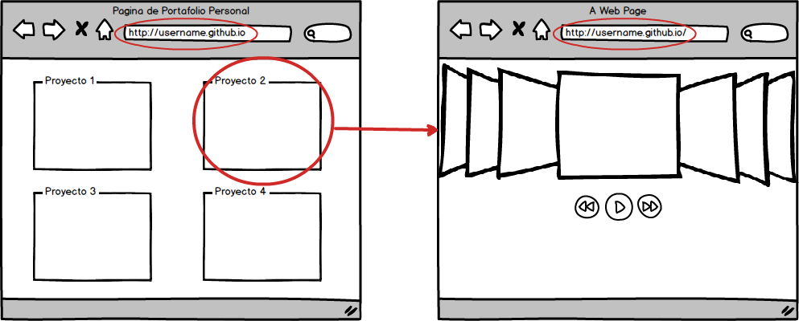

# Fundamentos
* Con su cuenta de github suba 2 páginas web y hosteelas utilizando github pages:
    * Página principal, página donde debiera estar su portafolio/curriculum digital.
    * Escoja alguno de los proyectos en los cuales ha trabajado y cree un github page asociado a ese proyecto. No olvide linkearlo a la página principal

## Resolución

Para poder realizar este Challenge, debe seguir el siguiente instructivo

[Crear páginas en github](https://pages.github.com/)

El resultado final debiese ser un flujo cómo el del diagrama adjunto.

